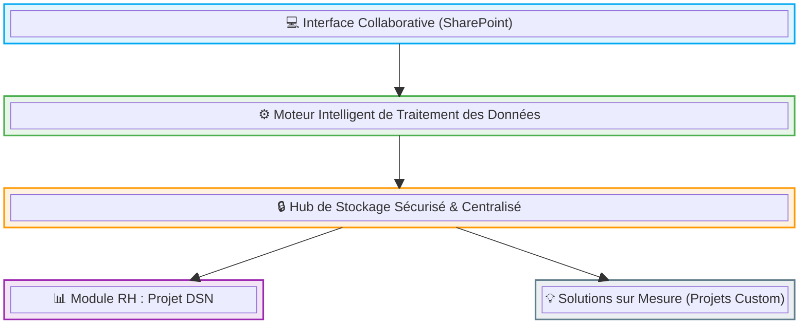

```mermaid
block-beta
  columns 3
  
  block:UX:3
    columns 1
    A["💻 Interface Collaborative (SharePoint)"] 
  end
  
  space:3
  
  block:Metier:3
    columns 1
    B["⚙️ Moteur Intelligent de Traitement des Données"] 
  end
  
  space:3
  
  block:Data:3
    columns 1
    C["🔒 Hub de Stockage Sécurisé & Centralisé"]
  end

  space:3

  block:DsnProjet:1
    D["📊 Module RH : Projet DSN"]
  end
  
  space:1 
  
  block:CustomProjet:1
    E["💡 Solutions sur Mesure (Projets Custom)"]
  end

  UX --> Metier
  Metier --> Data
  Data --> DsnProjet
  Data --> CustomProjet
  
  style UX fill:#e1f5fe,stroke:#03a9f4,stroke-width:2px
  style Metier fill:#e8f5e9,stroke:#4caf50,stroke-width:2px
  style Data fill:#fff3e0,stroke:#ff9800,stroke-width:2px
  style DsnProjet fill:#f3e5f5,stroke:#9c27b0,stroke-width:2px
  style CustomProjet fill:#eceff1,stroke:#607d8b,stroke-width:2px
```